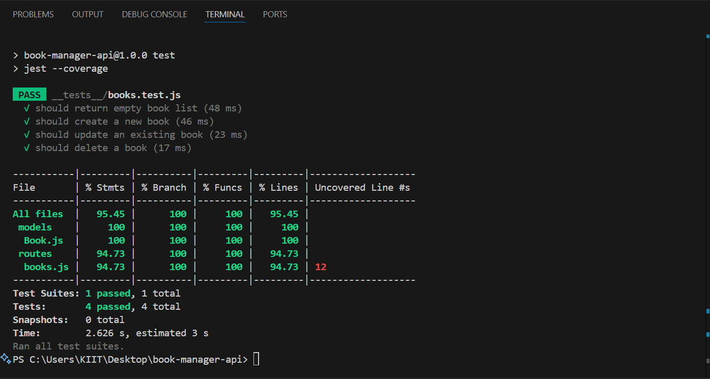

# 📚 Book Manager API

This is a full-stack Book Manager app built with Node.js, Express, MongoDB Atlas, and a simple HTML frontend.

---

## 🚀 Features

- ✅ Create, Read, Update, Delete books
- ✅ REST API built with Express
- ✅ MongoDB Atlas cloud database
- ✅ Frontend UI to interact with the API

---

## 🧱 Tech Stack

- **Backend:** Node.js, Express
- **Database:** MongoDB Atlas (via Mongoose)
- **Frontend:** HTML + JavaScript
- **Environment Variables:** `.env` for sensitive data

---

---

## 🔌 API Endpoints

| Method | Endpoint         | Description       |
|--------|------------------|-------------------|
| GET    | `/api/books`     | Get all books     |
| POST   | `/api/books`     | Add a new book    |
| PUT    | `/api/books/:id` | Update a book     |
| DELETE | `/api/books/:id` | Delete a book     |

---

## 💻 Running Locally

Once the server is running:
👉 http://localhost:5000

---

## ✅ Test Coverage Report

